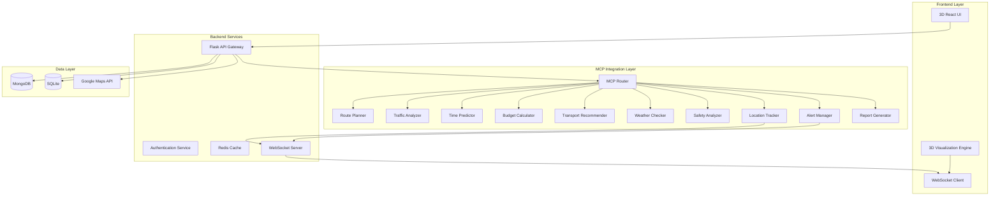
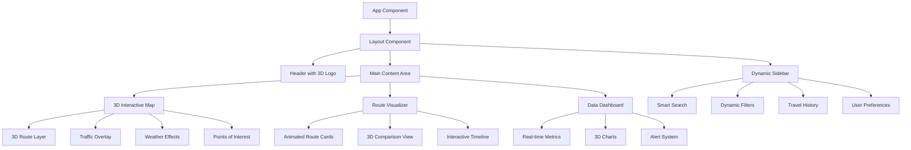

# Design Document: AI-Powered Smart Travel and Commute Optimization System

## Overview

The AI-Powered Smart Travel and Commute Optimization System is a sophisticated travel assistant that leverages 10 specialized MCP (Model Context Protocol) tools to deliver intelligent, real-time travel optimization. The system features a cutting-edge 3D interface that transforms traditional travel planning into an immersive, dynamic experience.

### Core Value Proposition

- **Intelligent Route Optimization**: Multi-modal journey planning with real-time traffic analysis
- **Immersive 3D Visualization**: Professional, dynamic interface with interactive 3D maps and data visualization
- **Real-Time Adaptation**: Continuous monitoring with proactive alerts and route adjustments
- **Cost-Conscious Planning**: Budget optimization across all transport modes
- **Safety-First Approach**: Comprehensive safety analysis with weather impact assessment

### Key Differentiators

- **3D Interactive Maps**: Immersive route visualization with elevation profiles and landmark recognition
- **Dynamic Data Visualization**: Real-time animated charts and graphs showing traffic, costs, and time predictions
- **Professional UI/UX**: Modern, responsive design with smooth animations and intuitive interactions
- **AI-Powered Insights**: Machine learning-driven recommendations that improve over time

## Architecture

### High-Level System Architecture



### Technology Stack

**Frontend:**
- React 18 with TypeScript
- Three.js for 3D graphics and animations
- React Three Fiber for React-Three.js integration
- Framer Motion for smooth UI animations
- Tailwind CSS for responsive styling
- WebGL for hardware-accelerated rendering

**Backend:**
- Flask with Python 3.11+
- Flask-SocketIO for real-time communication
- Redis for caching and session management
- Celery for background task processing

**Database:**
- MongoDB for user data and travel history
- SQLite for local caching and offline functionality

**External APIs:**
- Google Maps API for mapping and routing
- OpenWeatherMap API for weather data
- Various transport APIs (bus, train, rideshare)

## Components and Interfaces

### 3D Frontend Architecture

#### Core 3D Components

**1. Interactive 3D Map Component**
```typescript
interface Map3DProps {
  routes: Route3D[];
  userLocation: Coordinates;
  destination: Coordinates;
  viewMode: 'satellite' | 'terrain' | 'street';
  animationSpeed: number;
}

class Map3D extends React.Component<Map3DProps> {
  // 3D map rendering with elevation data
  // Interactive route visualization
  // Real-time traffic overlay
  // Weather condition visualization
}
```

**2. Dynamic Route Visualizer**
```typescript
interface RouteVisualizerProps {
  routes: OptimizedRoute[];
  selectedRoute: string;
  trafficData: TrafficCondition[];
  animateTransition: boolean;
}

class RouteVisualizer extends React.Component<RouteVisualizerProps> {
  // Animated route comparison
  // 3D traffic flow visualization
  // Cost and time overlay graphics
  // Interactive waypoint manipulation
}
```

**3. Real-Time Data Dashboard**
```typescript
interface DataDashboardProps {
  travelMetrics: TravelMetrics;
  alerts: Alert[];
  weatherConditions: WeatherData;
  budgetStatus: BudgetStatus;
}

class DataDashboard extends React.Component<DataDashboardProps> {
  // 3D animated charts and graphs
  // Real-time metric updates
  // Interactive data exploration
  // Predictive analytics visualization
}
```

#### UI/UX Design Philosophy

**Professional & Modern Design**
- Clean, minimalist interface with strategic use of white space
- Consistent color palette with accessibility compliance (WCAG 2.1 AA)
- Typography hierarchy using modern sans-serif fonts (Inter, Roboto)
- Subtle shadows and gradients for depth perception

**Dynamic & Interactive Elements**
- Smooth micro-animations for user feedback (200-300ms transitions)
- Hover states with 3D transform effects
- Loading animations with progress indicators
- Contextual tooltips with rich information

**3D Visual Elements**
- Isometric map views with smooth camera transitions
- Particle effects for weather visualization
- Animated route paths with directional flow indicators
- 3D building models for landmark recognition
- Elevation profiles with interactive cross-sections

### Frontend Component Hierarchy



### Backend API Architecture

#### Flask Application Structure

```python
# app/
# ├── __init__.py
# ├── api/
# │   ├── __init__.py
# │   ├── routes.py
# │   ├── travel.py
# │   ├── mcp_integration.py
# │   └── websocket.py
# ├── models/
# │   ├── __init__.py
# │   ├── travel_request.py
# │   ├── travel_plan.py
# │   └── user.py
# ├── services/
# │   ├── __init__.py
# │   ├── mcp_router.py
# │   ├── travel_optimizer.py
# │   └── alert_service.py
# └── utils/
#     ├── __init__.py
#     ├── validators.py
#     └── formatters.py
```

#### Core API Endpoints

**Travel Planning Endpoints**
```python
@app.route('/api/v1/travel/plan', methods=['POST'])
def create_travel_plan():
    """
    Create optimized travel plan from user request
    Returns: TravelPlan with 3D visualization data
    """

@app.route('/api/v1/travel/routes', methods=['GET'])
def get_route_alternatives():
    """
    Get alternative routes with 3D coordinate data
    Returns: List of Route3D objects
    """

@app.route('/api/v1/travel/optimize', methods=['POST'])
def optimize_existing_plan():
    """
    Re-optimize existing plan based on current conditions
    Returns: Updated TravelPlan
    """
```

**Real-Time Data Endpoints**
```python
@app.route('/api/v1/realtime/traffic', methods=['GET'])
def get_traffic_data():
    """
    Get current traffic conditions for visualization
    Returns: TrafficData with 3D overlay information
    """

@app.route('/api/v1/realtime/weather', methods=['GET'])
def get_weather_conditions():
    """
    Get weather data for route visualization
    Returns: WeatherData with 3D effects data
    """
```

#### WebSocket Events for Real-Time Updates

```python
# Real-time event types
EVENTS = {
    'LOCATION_UPDATE': 'location_update',
    'TRAFFIC_CHANGE': 'traffic_change',
    'ROUTE_ALERT': 'route_alert',
    'WEATHER_UPDATE': 'weather_update',
    'PLAN_OPTIMIZATION': 'plan_optimization'
}

@socketio.on('subscribe_to_route')
def handle_route_subscription(data):
    """Subscribe to real-time updates for specific route"""
    
@socketio.on('location_update')
def handle_location_update(data):
    """Process user location updates for tracking"""
```

### MCP Tool Integration

#### MCP Router Service

```python
class MCPRouter:
    """Central router for MCP tool communication"""
    
    def __init__(self):
        self.tools = {
            'route_planner': RoutePlannerMCP(),
            'traffic_analyzer': TrafficAnalyzerMCP(),
            'time_predictor': TimePredictorMCP(),
            'budget_calculator': BudgetCalculatorMCP(),
            'transport_recommender': TransportRecommenderMCP(),
            'weather_checker': WeatherCheckerMCP(),
            'safety_analyzer': SafetyAnalyzerMCP(),
            'alert_manager': AlertManagerMCP(),
            'location_tracker': LocationTrackerMCP(),
            'report_generator': ReportGeneratorMCP()
        }
    
    async def execute_tool(self, tool_name: str, params: dict) -> dict:
        """Execute MCP tool with error handling and caching"""
        
    async def execute_parallel(self, tool_requests: List[ToolRequest]) -> List[ToolResponse]:
        """Execute multiple MCP tools in parallel for performance"""
```

#### Individual MCP Tool Interfaces

```python
class RoutePlannerMCP(BaseMCPTool):
    """Route planning with 3D coordinate generation"""
    
    async def find_routes(self, source: Location, destination: Location) -> List[Route3D]:
        """Find alternative routes with elevation and 3D data"""
        
    async def optimize_route(self, route: Route, constraints: RouteConstraints) -> Route3D:
        """Optimize existing route with 3D visualization data"""

class TrafficAnalyzerMCP(BaseMCPTool):
    """Traffic analysis with real-time visualization data"""
    
    async def analyze_traffic(self, routes: List[Route]) -> List[TrafficCondition]:
        """Analyze traffic with 3D overlay data for visualization"""
        
    async def predict_congestion(self, route: Route, time: datetime) -> CongestionPrediction:
        """Predict future traffic conditions"""
```

## Data Models

### Core Data Structures

#### Travel Request Model

```python
from dataclasses import dataclass
from typing import Optional, List
from datetime import datetime
from enum import Enum

@dataclass
class Location:
    latitude: float
    longitude: float
    elevation: Optional[float] = None
    address: Optional[str] = None
    place_id: Optional[str] = None

@dataclass
class TimeConstraints:
    departure_time: Optional[datetime] = None
    arrival_time: Optional[datetime] = None
    flexibility_minutes: int = 15

@dataclass
class BudgetConstraints:
    max_cost: Optional[float] = None
    preferred_cost: Optional[float] = None
    currency: str = "USD"

@dataclass
class TravelRequest:
    id: str
    user_id: str
    source: Location
    destination: Location
    time_constraints: TimeConstraints
    budget_constraints: BudgetConstraints
    preferences: dict
    created_at: datetime
    
    def to_dict(self) -> dict:
        """Convert to dictionary for API serialization"""
        
    @classmethod
    def from_dict(cls, data: dict) -> 'TravelRequest':
        """Create from dictionary for API deserialization"""
```

#### 3D Route Model

```python
@dataclass
class Coordinate3D:
    latitude: float
    longitude: float
    elevation: float
    timestamp: Optional[datetime] = None

@dataclass
class RouteSegment3D:
    coordinates: List[Coordinate3D]
    transport_mode: str
    distance_meters: float
    duration_seconds: int
    cost: float
    instructions: List[str]
    traffic_conditions: List[TrafficCondition]

@dataclass
class Route3D:
    id: str
    segments: List[RouteSegment3D]
    total_distance: float
    total_duration: int
    total_cost: float
    safety_rating: float
    weather_impact: WeatherImpact
    visualization_data: RouteVisualizationData
    
    def get_elevation_profile(self) -> List[ElevationPoint]:
        """Generate elevation profile for 3D visualization"""
        
    def get_traffic_overlay_data(self) -> TrafficOverlayData:
        """Generate traffic overlay data for 3D map"""
```

#### Travel Plan Model

```python
@dataclass
class TravelPlan:
    id: str
    request_id: str
    recommended_route: Route3D
    alternative_routes: List[Route3D]
    transport_recommendations: List[TransportOption]
    alerts: List[Alert]
    confidence_score: float
    created_at: datetime
    expires_at: datetime
    
    def to_3d_visualization_data(self) -> VisualizationData:
        """Convert plan to 3D visualization format"""
```

### Database Schema

#### MongoDB Collections

**Users Collection**
```javascript
{
  _id: ObjectId,
  email: String,
  preferences: {
    transport_modes: [String],
    budget_preference: String,
    safety_priority: Number,
    ui_theme: String,
    notification_settings: Object
  },
  travel_history: [ObjectId], // References to travel_plans
  created_at: Date,
  updated_at: Date
}
```

**Travel Plans Collection**
```javascript
{
  _id: ObjectId,
  user_id: ObjectId,
  request: {
    source: {
      latitude: Number,
      longitude: Number,
      elevation: Number,
      address: String
    },
    destination: {
      latitude: Number,
      longitude: Number,
      elevation: Number,
      address: String
    },
    time_constraints: Object,
    budget_constraints: Object
  },
  routes: [{
    id: String,
    segments: [Object],
    visualization_data: Object,
    metrics: Object
  }],
  selected_route_id: String,
  status: String, // 'planning', 'active', 'completed', 'cancelled'
  real_time_data: Object,
  created_at: Date,
  updated_at: Date
}
```

#### SQLite Schema (Local Cache)

```sql
-- Route cache for offline functionality
CREATE TABLE route_cache (
    id TEXT PRIMARY KEY,
    source_lat REAL NOT NULL,
    source_lng REAL NOT NULL,
    dest_lat REAL NOT NULL,
    dest_lng REAL NOT NULL,
    route_data TEXT NOT NULL, -- JSON serialized route
    created_at TIMESTAMP DEFAULT CURRENT_TIMESTAMP,
    expires_at TIMESTAMP NOT NULL
);

-- Traffic data cache
CREATE TABLE traffic_cache (
    id TEXT PRIMARY KEY,
    route_id TEXT NOT NULL,
    traffic_data TEXT NOT NULL, -- JSON serialized traffic conditions
    created_at TIMESTAMP DEFAULT CURRENT_TIMESTAMP,
    expires_at TIMESTAMP NOT NULL
);

-- User preferences cache
CREATE TABLE user_preferences (
    user_id TEXT PRIMARY KEY,
    preferences TEXT NOT NULL, -- JSON serialized preferences
    updated_at TIMESTAMP DEFAULT CURRENT_TIMESTAMP
);
```

## Correctness Properties

*A property is a characteristic or behavior that should hold true across all valid executions of a system-essentially, a formal statement about what the system should do. Properties serve as the bridge between human-readable specifications and machine-verifiable correctness guarantees.*

### Property Reflection

After analyzing all acceptance criteria, several properties can be consolidated to eliminate redundancy:

- Location validation, time constraint acceptance, and budget storage can be combined into a comprehensive input validation property
- Route analysis properties (traffic, time, safety, weather) can be consolidated into a route completeness property
- Transport evaluation and cost calculation can be combined into transport analysis completeness
- Multiple parsing properties can be unified under the round-trip parsing property
- Multi-modal journey properties can be consolidated into comprehensive multi-modal planning

### Property 1: Input Validation and Storage Round-Trip

*For any* valid travel request input (locations, time constraints, budget), the system should successfully validate, store, and retrieve equivalent data without loss or corruption.

**Validates: Requirements 1.1, 1.2, 1.3**

### Property 2: Natural Language Parsing Round-Trip

*For any* valid travel request, parsing the natural language input into a structured Travel_Request object, then formatting it back to natural language, then parsing again should produce an equivalent Travel_Request object.

**Validates: Requirements 11.1, 11.4, 11.5**

### Property 3: Route Analysis Completeness

*For any* valid travel request, the system should generate routes where each route has complete analysis data including traffic conditions, time predictions, safety ratings, and weather impact assessments.

**Validates: Requirements 2.1, 2.2, 2.3, 2.4, 2.5**

### Property 4: Transport Mode Evaluation Completeness

*For any* route, the system should evaluate all available transport modes (bus, train, taxi, rideshare, bike) and provide complete cost calculations including all fees and charges.

**Validates: Requirements 3.1, 3.2, 6.4**

### Property 5: Budget Constraint Enforcement

*For any* travel request with budget constraints, all recommended options should have total costs that do not exceed the specified maximum budget.

**Validates: Requirements 6.1, 6.2**

### Property 6: Travel Plan Completeness

*For any* generated travel plan, it should include all required components: route details, transport modes, time estimates, costs, step-by-step directions, and backup options.

**Validates: Requirements 5.1, 5.2, 5.4, 5.5**

### Property 7: Multi-Modal Journey Optimization

*For any* multi-modal journey, the system should ensure minimum connection times are met and total costs include all segments with optimized transfer points.

**Validates: Requirements 12.2, 12.3, 12.4, 12.5**

### Property 8: Safety Analysis Consistency

*For any* route, safety ratings should be provided on a 1-10 scale and night travel routes (10 PM - 6 AM) should prioritize well-lit, populated paths.

**Validates: Requirements 7.1, 7.2, 7.5**

### Property 9: Weather-Responsive Planning

*For any* travel request during adverse weather conditions, the system should provide weather impact assessments and adjust time estimates accordingly.

**Validates: Requirements 8.1, 8.2, 8.4**

### Property 10: Data Storage and Retrieval Integrity

*For any* user data (preferences, travel history), storing then retrieving should produce equivalent data without corruption or loss.

**Validates: Requirements 10.1, 10.4**

## 3D User Interface Design

### Design Philosophy and Visual Identity

The AI-Powered Smart Travel and Commute Optimization System features a cutting-edge 3D interface that transforms traditional travel planning into an immersive, professional experience. The design philosophy centers on three core principles:

**1. Spatial Intelligence**
- 3D visualization helps users understand complex route relationships
- Elevation profiles and terrain awareness for better decision-making
- Spatial context for landmarks, traffic patterns, and weather conditions

**2. Dynamic Responsiveness**
- Real-time data visualization with smooth animations
- Contextual interface adaptation based on travel conditions
- Progressive disclosure of information based on user needs

**3. Professional Aesthetics**
- Clean, modern design language with premium materials
- Consistent visual hierarchy and typography
- Accessibility-first approach with WCAG 2.1 AA compliance

### 3D Interface Components

#### 1. Immersive 3D Map Experience

**Core Features:**
- **Isometric 3D View**: Tilted perspective showing elevation, buildings, and terrain
- **Smooth Camera Transitions**: Cinematic movement between viewpoints
- **Interactive Terrain**: Click-and-drag to explore, pinch-to-zoom with momentum
- **Dynamic Lighting**: Time-of-day lighting that matches actual conditions
- **Weather Visualization**: Particle effects for rain, snow, fog with realistic rendering

**Technical Implementation:**
```typescript
interface Map3DConfig {
  camera: {
    position: Vector3;
    target: Vector3;
    fov: number;
    near: number;
    far: number;
  };
  lighting: {
    ambient: Color;
    directional: DirectionalLight;
    shadows: boolean;
  };
  terrain: {
    elevation: boolean;
    buildings: boolean;
    vegetation: boolean;
  };
  effects: {
    weather: WeatherEffect[];
    traffic: TrafficVisualization;
    animations: AnimationConfig;
  };
}
```

**Visual Design Elements:**
- **Material Design**: Glass-morphism effects with subtle transparency
- **Color Palette**: 
  - Primary: Deep Blue (#1E3A8A) for trust and reliability
  - Secondary: Emerald Green (#10B981) for eco-friendly options
  - Accent: Amber (#F59E0B) for alerts and warnings
  - Neutral: Cool Gray (#64748B) for secondary information
- **Typography**: Inter font family for excellent readability
- **Shadows**: Soft, realistic shadows with proper depth perception

#### 2. Dynamic Route Visualization

**3D Route Rendering:**
- **Elevated Path Lines**: Routes float above terrain with gradient colors
- **Traffic Flow Animation**: Moving particles showing congestion levels
- **Multi-Modal Indicators**: Different visual styles for walk/drive/transit segments
- **Cost Visualization**: Route thickness varies with cost (thicker = more expensive)
- **Time Indicators**: Animated progress bars showing estimated travel time

**Interactive Features:**
- **Route Comparison**: Side-by-side 3D view of alternative routes
- **Segment Details**: Hover over route segments for detailed information
- **What-If Scenarios**: Drag route points to see alternative paths
- **Historical Data**: Time-lapse visualization of traffic patterns

**Code Structure:**
```typescript
class Route3DRenderer {
  private scene: THREE.Scene;
  private routes: Route3D[];
  private animations: AnimationMixer[];
  
  renderRoute(route: Route3D): void {
    // Create 3D path geometry
    // Apply materials and textures
    // Add traffic flow animations
    // Implement interactive hover states
  }
  
  animateTrafficFlow(route: Route3D): void {
    // Particle system for traffic visualization
    // Color-coded congestion levels
    // Smooth transitions between states
  }
}
```

#### 3. Professional Dashboard Interface

**Layout Structure:**
- **Primary Panel**: 3D map takes 70% of screen real estate
- **Side Panel**: Collapsible information panel (30% width)
- **Bottom Bar**: Quick actions and status indicators
- **Floating Cards**: Contextual information overlays

**3D Dashboard Elements:**
- **Floating Information Cards**: Glass-morphism cards with depth shadows
- **3D Progress Indicators**: Cylindrical progress bars with realistic lighting
- **Animated Charts**: 3D bar charts and line graphs for cost/time comparisons
- **Interactive Toggles**: 3D switch components with satisfying animations

**Responsive Design:**
```css
/* Desktop Layout */
.dashboard-container {
  display: grid;
  grid-template-columns: 1fr 400px;
  grid-template-rows: 60px 1fr 80px;
  height: 100vh;
  gap: 16px;
  padding: 16px;
}

/* Tablet Layout */
@media (max-width: 1024px) {
  .dashboard-container {
    grid-template-columns: 1fr;
    grid-template-rows: 60px 1fr 300px 80px;
  }
}

/* Mobile Layout */
@media (max-width: 768px) {
  .dashboard-container {
    grid-template-rows: 60px 1fr 200px 80px;
    padding: 8px;
    gap: 8px;
  }
}
```

#### 4. Real-Time Data Visualization

**3D Data Components:**
- **Traffic Heatmaps**: 3D surface plots showing congestion intensity
- **Weather Overlays**: Volumetric rendering of precipitation and visibility
- **Cost Comparison Charts**: 3D bar charts with smooth transitions
- **Time Prediction Graphs**: Animated line charts with confidence intervals

**Animation System:**
```typescript
class DataVisualizationEngine {
  private animationQueue: Animation[];
  private transitionDuration: number = 300;
  
  updateTrafficData(newData: TrafficData[]): void {
    // Smooth transition from old to new data
    // Maintain visual continuity
    // Highlight significant changes
  }
  
  animateRouteComparison(routes: Route3D[]): void {
    // Staggered animation entrance
    // Highlight best option
    // Interactive comparison controls
  }
}
```

### Advanced 3D Features

#### 1. Augmented Reality Integration

**AR Route Preview:**
- Camera overlay showing optimal path
- Real-time navigation arrows in 3D space
- Landmark recognition and labeling
- Distance and time indicators floating in view

#### 2. Gesture Controls

**Touch Interactions:**
- **Pinch-to-Zoom**: Smooth scaling with momentum
- **Pan Gestures**: Fluid map movement with inertia
- **Rotation**: Two-finger rotation for 3D perspective changes
- **Long Press**: Context menus with 3D popup effects

**Desktop Interactions:**
- **Mouse Wheel**: Zoom with smooth acceleration curves
- **Click-and-Drag**: Map panning with momentum physics
- **Keyboard Shortcuts**: Power user navigation controls
- **Hover States**: Rich tooltips with 3D preview cards

#### 3. Accessibility Features

**3D Accessibility:**
- **High Contrast Mode**: Enhanced color differentiation
- **Motion Reduction**: Disable animations for sensitive users
- **Screen Reader Support**: Detailed descriptions of 3D elements
- **Keyboard Navigation**: Full functionality without mouse
- **Voice Commands**: Natural language interface for hands-free operation

### Performance Optimization

#### 1. 3D Rendering Optimization

**Level of Detail (LOD):**
- Automatic quality adjustment based on zoom level
- Simplified geometry for distant objects
- Progressive loading of high-detail models

**Efficient Rendering:**
```typescript
class PerformanceManager {
  private frameRate: number = 60;
  private qualityLevel: 'low' | 'medium' | 'high' = 'high';
  
  optimizeForDevice(): void {
    // Detect device capabilities
    // Adjust rendering quality
    // Enable/disable advanced effects
  }
  
  monitorPerformance(): void {
    // Track FPS and memory usage
    // Automatically adjust quality
    // Provide user controls for manual override
  }
}
```

#### 2. Data Loading Strategy

**Progressive Enhancement:**
- Load basic 2D map first
- Progressively add 3D elements
- Stream high-resolution textures
- Cache frequently accessed data

**Offline Capabilities:**
- Cache 3D models and textures locally
- Offline route calculation with cached data
- Graceful degradation when connectivity is poor

## Error Handling

### Error Categories and Responses

#### 1. Input Validation Errors

**Location Validation:**
- Invalid coordinates: Provide suggested corrections
- Ambiguous addresses: Present disambiguation options
- Unreachable destinations: Suggest nearest accessible points

**Time Constraint Errors:**
- Past departure times: Auto-adjust to current time
- Impossible arrival times: Calculate minimum required time
- Conflicting constraints: Highlight conflicts with suggestions

#### 2. MCP Tool Failures

**Graceful Degradation Strategy:**
```python
class MCPErrorHandler:
    def __init__(self):
        self.fallback_strategies = {
            'route_planner': self.use_cached_routes,
            'traffic_analyzer': self.use_historical_data,
            'weather_checker': self.use_basic_forecast,
            'budget_calculator': self.use_estimated_costs
        }
    
    async def handle_tool_failure(self, tool_name: str, error: Exception) -> dict:
        """Handle MCP tool failures with appropriate fallbacks"""
        if tool_name in self.fallback_strategies:
            return await self.fallback_strategies[tool_name]()
        else:
            return self.provide_basic_functionality()
```

#### 3. Real-Time Data Errors

**Network Connectivity Issues:**
- Automatic retry with exponential backoff
- Switch to cached data with staleness indicators
- Provide offline mode with limited functionality

**API Rate Limiting:**
- Implement request queuing and throttling
- Use cached data when available
- Prioritize critical requests (safety, alerts)

#### 4. 3D Rendering Errors

**WebGL Compatibility:**
- Detect WebGL support and version
- Fallback to 2D interface for unsupported devices
- Provide manual quality controls

**Performance Issues:**
- Automatic quality reduction on low-end devices
- Frame rate monitoring with adaptive rendering
- Memory usage optimization

### User-Friendly Error Messages

**Error Message Design Principles:**
- Clear, non-technical language
- Actionable suggestions for resolution
- Visual indicators with appropriate severity levels
- Contextual help and documentation links

**Example Error Messages:**
```typescript
const errorMessages = {
  locationNotFound: {
    title: "Location Not Found",
    message: "We couldn't find that address. Try being more specific or use a nearby landmark.",
    actions: ["Try Again", "Use Current Location", "Browse Map"]
  },
  routeUnavailable: {
    title: "Route Temporarily Unavailable",
    message: "Traffic data is currently unavailable. We're showing you the best route based on typical conditions.",
    actions: ["Refresh", "Use Cached Data", "Try Alternative"]
  },
  budgetExceeded: {
    title: "Over Budget",
    message: "All available options exceed your budget of $25. Here are some cost-saving suggestions:",
    actions: ["Increase Budget", "Try Off-Peak Times", "Consider Public Transit"]
  }
};
```

## Testing Strategy

### Dual Testing Approach

The testing strategy employs both unit testing and property-based testing to ensure comprehensive coverage and correctness validation.

#### Unit Testing Focus Areas

**Specific Examples and Edge Cases:**
- Location parsing with various address formats
- Time constraint validation with edge cases (midnight, timezone changes)
- Budget calculation with different currencies and fee structures
- 3D rendering with different device capabilities
- Error handling scenarios with specific failure modes

**Integration Testing:**
- MCP tool integration with mock responses
- Database operations with test data
- API endpoint functionality with various request formats
- WebSocket communication for real-time updates
- 3D rendering pipeline with different browsers

#### Property-Based Testing Configuration

**Testing Library:** Hypothesis (Python) for backend, fast-check (TypeScript) for frontend
**Minimum Iterations:** 100 per property test
**Test Tagging Format:** **Feature: smart-travel-optimization-system, Property {number}: {property_text}**

**Property Test Examples:**
```python
from hypothesis import given, strategies as st
import pytest

@given(
    source=st.builds(Location, 
                    latitude=st.floats(-90, 90), 
                    longitude=st.floats(-180, 180)),
    destination=st.builds(Location, 
                         latitude=st.floats(-90, 90), 
                         longitude=st.floats(-180, 180)),
    budget=st.floats(min_value=0, max_value=1000)
)
def test_input_validation_round_trip(source, destination, budget):
    """
    Feature: smart-travel-optimization-system, Property 1: 
    For any valid travel request input, the system should successfully 
    validate, store, and retrieve equivalent data without loss or corruption.
    """
    request = TravelRequest(source=source, destination=destination, budget=budget)
    stored_request = store_and_retrieve_request(request)
    assert request.equals(stored_request)

@given(natural_language_input=st.text(min_size=10, max_size=200))
def test_natural_language_parsing_round_trip(natural_language_input):
    """
    Feature: smart-travel-optimization-system, Property 2:
    For any valid travel request, parsing natural language input into structured
    data, then formatting back to natural language, then parsing again should
    produce equivalent results.
    """
    if is_valid_travel_request(natural_language_input):
        parsed = parse_travel_request(natural_language_input)
        formatted = format_travel_request(parsed)
        reparsed = parse_travel_request(formatted)
        assert parsed.equals(reparsed)
```

**Frontend Property Tests:**
```typescript
import fc from 'fast-check';

describe('3D Route Visualization', () => {
  it('should maintain route data integrity during 3D transformations', () => {
    /**
     * Feature: smart-travel-optimization-system, Property 3:
     * For any route data, 3D visualization transformations should preserve
     * all route information without data loss or corruption.
     */
    fc.assert(fc.property(
      fc.record({
        coordinates: fc.array(fc.record({
          lat: fc.float(-90, 90),
          lng: fc.float(-180, 180),
          elevation: fc.float(0, 8848)
        })),
        segments: fc.array(fc.record({
          mode: fc.constantFrom('walk', 'drive', 'transit'),
          duration: fc.nat(7200),
          cost: fc.float(0, 500)
        }))
      }),
      (routeData) => {
        const visualized = render3DRoute(routeData);
        const extracted = extractRouteData(visualized);
        expect(extracted).toEqual(routeData);
      }
    ));
  });
});
```

### Performance Testing

**3D Rendering Performance:**
- Frame rate consistency across different devices
- Memory usage optimization with large datasets
- Loading time benchmarks for various network conditions

**API Response Times:**
- Travel plan generation under 5 seconds
- Real-time update latency under 2 seconds
- Concurrent user load testing

### Accessibility Testing

**3D Interface Accessibility:**
- Screen reader compatibility with 3D elements
- Keyboard navigation for all 3D interactions
- High contrast mode effectiveness
- Motion sensitivity accommodations

**Testing Tools:**
- axe-core for automated accessibility testing
- Manual testing with screen readers (NVDA, JAWS, VoiceOver)
- Keyboard-only navigation testing
- Color contrast validation

### Cross-Platform Testing

**Browser Compatibility:**
- Chrome, Firefox, Safari, Edge (latest 2 versions)
- WebGL support validation
- Mobile browser testing (iOS Safari, Chrome Mobile)

**Device Testing:**
- Desktop: Windows, macOS, Linux
- Mobile: iOS 14+, Android 10+
- Tablet: iPad, Android tablets
- Performance across different hardware capabilities

This comprehensive design document provides a solid foundation for building a professional, attractive, and highly dynamic 3D travel optimization system that meets all user requirements while maintaining excellent performance and accessibility standards.